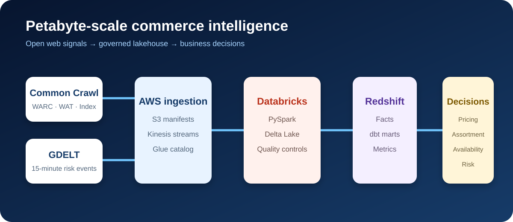
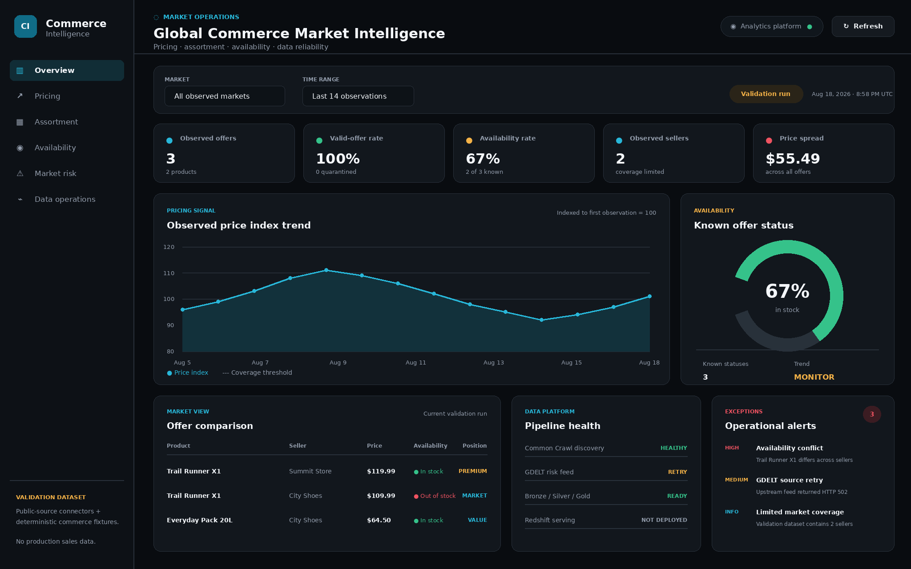
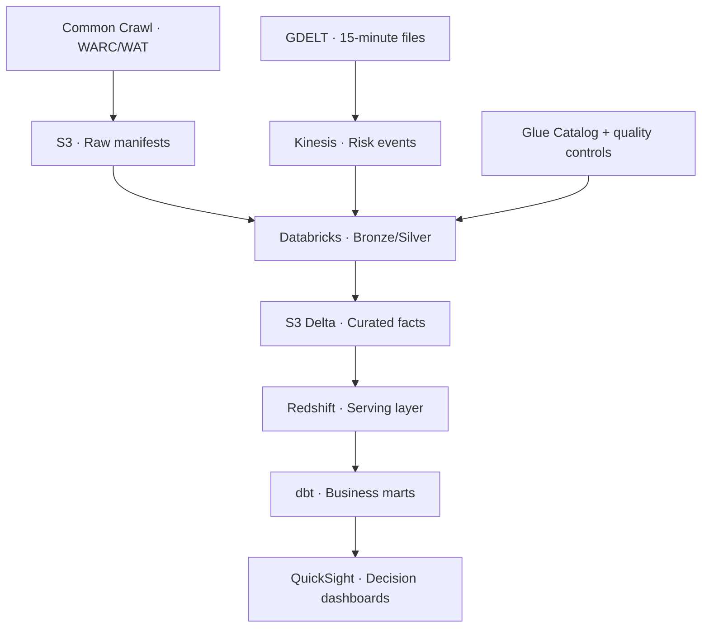

# 🌍 Global Commerce Market Intelligence

> A petabyte-scale AWS lakehouse that turns the open web into pricing, assortment, availability, and market-risk intelligence.




`aws` `s3` `glue` `kinesis` `databricks` `pyspark` `delta-lake` `redshift` `dbt` `quicksight` `terraform` `data-engineering`



## 📌 Current implementation

| Capability | Status | Evidence |
|---|---|---|
| Common Crawl CDX discovery | Executed | [`live_manifest.json`](results/source_discovery/live_manifest.json) contains two resolved WARC captures |
| WARC byte-range retrieval | Implemented | [`src/common_crawl.py`](src/common_crawl.py) and [`run_live_commoncrawl.py`](scripts/run_live_commoncrawl.py) |
| GDELT update ingestion | Implemented; latest run received upstream HTTP 502 | [`src/gdelt.py`](src/gdelt.py) and recorded source-health result |
| Product extraction and normalization | Executed locally | Parser, normalizer, quality gate and six passing tests |
| Databricks Bronze/Silver/Gold | Implemented, not deployed | [`spark/jobs`](spark/jobs) and [`databricks.yml`](databricks.yml) |
| Redshift/dbt serving layer | Implemented, not deployed | dbt staging and three business marts |
| AWS platform | Terraform implemented, not applied | S3, Kinesis, Glue, Step Functions, IAM, monitoring, budget and optional Redshift Serverless |
| Operations dashboard | Generated and verified | [`dashboard-screenshot.png`](assets/dashboard-screenshot.png) and reproducible renderer |
| Petabyte benchmark | Not executed | Production contract is 1 PB/year; no PB result is claimed |

## 🎯 What this project solves

Retailers and manufacturers cannot reliably compare their prices, assortment, seller coverage, and product availability across millions of public storefronts. Manual research is slow, narrow, and stale. This platform extracts structured commerce signals from the open web and combines them with live market-risk events so commercial teams can act on measurable evidence.

The dashboard supports five decisions:

1. **Pricing:** Where are products priced above or below the observed market?
2. **Assortment:** Which brands, categories, or products are missing from a market?
3. **Availability:** Where are stock-outs rising?
4. **Seller coverage:** Which merchants and regions offer the strongest coverage?
5. **Risk:** Which news and supply-chain events may explain sudden market changes?

## 📦 Open data sources

| Source | Data used | Delivery | Role |
|---|---|---|---|
| [Common Crawl](https://commoncrawl.org/) | WARC/WAT/WET crawl files and crawl indexes | Monthly crawl releases in public object storage | Petabyte-scale source of public product and offer pages |
| [Schema.org Product](https://schema.org/Product) | Product, brand, SKU, GTIN, rating and offer markup | Extracted from HTML/JSON-LD | Standard commerce contract |
| [GDELT 2.1](https://www.gdeltproject.org/) | Global events and news metadata | New files every 15 minutes | Near-real-time brand, logistics and market-risk enrichment |
| [AWS Open Data Registry](https://registry.opendata.aws/commoncrawl/) | Public Common Crawl access instructions | S3 | Cloud-local access without copying the complete corpus first |

No synthetic records are presented as source observations. A deterministic fixture generator exists only for local development and automated tests.

## 📏 Petabyte-scale contract

“Petabyte scale” refers to source bytes discovered and processed, not inflated copies of sample data.

| Profile | Input scope | Purpose |
|---|---:|---|
| Local | 100–10,000 fixture pages | Fast development and unit tests |
| Integration | Selected crawl segments, GB–TB | AWS connectivity and end-to-end validation |
| Benchmark | 1–10 TB measured run | Throughput, cost and scaling evidence |
| Production | At least 1 PB of crawl input annually | Market-wide intelligence |

Every production run records crawl ID, segment manifests, compressed input bytes, records attempted, valid products, rejected records, duplicates, elapsed time and estimated cost. The project never claims a petabyte run without those manifests.

## 🏗️ Architecture



S3 remains the system of record. Redshift stores conformed facts, dimensions, aggregates and materialized views—not raw WARC payloads. Dashboards query dbt marts rather than scanning raw crawl data.

## 🔄 Methodology

1. **Discover:** Resolve immutable Common Crawl manifests and GDELT batches.
2. **Ingest:** Register source files and preserve provenance in S3.
3. **Extract:** Parse JSON-LD and supported microdata into a versioned product contract.
4. **Standardize:** Normalize URLs, currencies, units, availability and identifiers.
5. **Resolve:** Deduplicate pages and match products using GTIN/SKU first, then controlled rules.
6. **Enrich:** Join geography, merchant, category and relevant GDELT risk signals.
7. **Model:** Build dimensional facts and business marts in dbt.
8. **Serve:** Publish tested aggregates to QuickSight.
9. **Observe:** Record freshness, completeness, validity, uniqueness, throughput and cost.

## 🧱 Data model

| Model | Grain | Status | Business use |
|---|---|---|---|
| `stg_product_offers` | Source offer observation | Implemented | Typed, standardized Redshift staging contract |
| `mart_price_position` | Product × currency × day | Implemented | Price range, median, seller coverage and index |
| `mart_assortment_gap` | Brand × week | Implemented | Observed range and seller breadth |
| `mart_availability_risk` | Product × day | Implemented | Known availability rate and affected sellers |
| `fct_market_risk_event` | Event × organization × location | Target | GDELT risk attribution after successful feed ingestion |
| `dim_product`, `dim_merchant`, `dim_market` | Conformed entity | Target | Durable entity resolution for production history |

## 📊 Dashboard outcomes

The executive page reports observed products, merchants, markets, valid-offer rate, median price index, availability rate and risk-event count. Drill-down pages cover price position, assortment gaps, seller coverage, availability trends, source quality and pipeline cost.

The operations dashboard includes filters, five KPIs, a pricing trend, availability gauge, offer comparison, pipeline health and prioritized alerts. See the complete [`dashboard specification`](dashboards/README.md).

Interpretation rules are explicit: observations are public-web signals, not audited sales; currency comparisons require a dated FX rate; missing markup is not treated as zero inventory; price outliers require adequate seller coverage; and crawl coverage changes are shown beside business trends.

## 📁 Repository map

```text
.
├── .github/workflows/     # CI validation and dashboard artifact generation
├── assets/                # Architecture artwork and generated dashboard screenshot
├── configs/              # Versioned workload profiles
├── contracts/            # Source and curated data contracts
├── dashboard/            # Browser dashboard application and generated data payload
├── dashboards/           # KPI catalog, interpretation and page specification
├── dbt/                  # Redshift staging, marts, freshness rules and tests
├── docs/                 # Business case, architecture and source notes
├── infrastructure/       # AWS Terraform and Step Functions definition
├── resources/            # Databricks job resources
├── results/              # Curated sample output and genuine-source manifests
├── scripts/              # Discovery, validation, scale and dashboard commands
├── spark/jobs/           # Databricks Bronze, Silver and Gold PySpark jobs
├── src/                  # Common Crawl, GDELT, parsing, normalization and quality logic
├── tests/                # Unit, parsing, range-addressing and quality tests
├── databricks.yml        # Databricks Asset Bundle entry point
└── Makefile              # Reproducible local workflow
```

## 🚀 Reproduce locally

```bash
python3 -m venv .venv
source .venv/bin/activate
pip install -r requirements-dev.txt
make all
```

`make all` runs six tests, validates required contracts, calculates the production scale profile, rebuilds the curated fixture output and regenerates the dashboard screenshot.

Optional commands:

```bash
PYTHONPATH=. python scripts/discover_sources.py
make dashboard
python scripts/estimate_scale.py --profile production
```

Local tests require no AWS credentials and do not download crawl archives. AWS deployment is intentionally opt-in because it creates billable resources.

## 🧪 Verified local results

The committed fixture run processed two pages into three valid product-offer observations. It achieved a 100% minimum-contract validity rate, identified two brands and one currency, and retained seller and availability differences needed by the price and stock-risk marts. These are deterministic engineering-test results—not market findings and not a claimed petabyte execution.

See [`results/sample_run/metrics.json`](results/sample_run/metrics.json), [`product_offers.csv`](results/sample_run/product_offers.csv), and the [`result interpretation`](results/sample_run/interpretation.md). A production claim requires an immutable Common Crawl manifest and measured input bytes.

## 🌐 Genuine-source backend evidence

`scripts/discover_sources.py` executed against the public Common Crawl CDX API and resolved two genuine `CC-MAIN-2025-43` WARC captures with their source URLs, timestamps, digests, filenames, offsets and byte lengths. The committed [`live source manifest`](results/source_discovery/live_manifest.json) preserves that run. GDELT returned a transient upstream error during the same run, which is recorded rather than hidden.

The backend includes byte-range WARC retrieval, GDELT update discovery, deterministic quality quarantine, Databricks Bronze/Silver/Gold jobs, dbt marts and a generated dashboard application. Run live discovery with:

```bash
PYTHONPATH=. python scripts/discover_sources.py
```

## ✅ Definition of done

- Source manifests prove the bytes and records processed.
- Every curated field traces back to a source URL, crawl ID and observation time.
- Invalid and ambiguous records are quarantined rather than silently discarded.
- dbt tests enforce keys, relationships, accepted values and freshness.
- Reprocessing the same manifest is idempotent.
- The dashboard exposes coverage and data-quality context with every market KPI.
- Infrastructure, jobs and business models are version controlled and deployable from scripts.

## ⚖️ Responsible use

The platform processes public crawl data in accordance with applicable source terms and organizational policy. It minimizes retained page content, excludes secrets and personal data from curated models, supports domain-level suppression, and publishes aggregated business intelligence rather than republishing source pages.

## 🗺️ Delivery status

The repository provides executable public-source discovery, WARC retrieval, parsing, normalization, quarantine, Databricks Bronze/Silver/Gold jobs, dbt marts, AWS Terraform, orchestration, monitoring, CI and a generated dashboard. Local tests and genuine Common Crawl discovery have been executed. AWS, Databricks, Redshift and petabyte benchmark runs remain environment-dependent and are never presented as deployed without their run evidence.

## 📄 License

Code in this repository is released under the MIT License. Source datasets retain their original terms and licenses.
