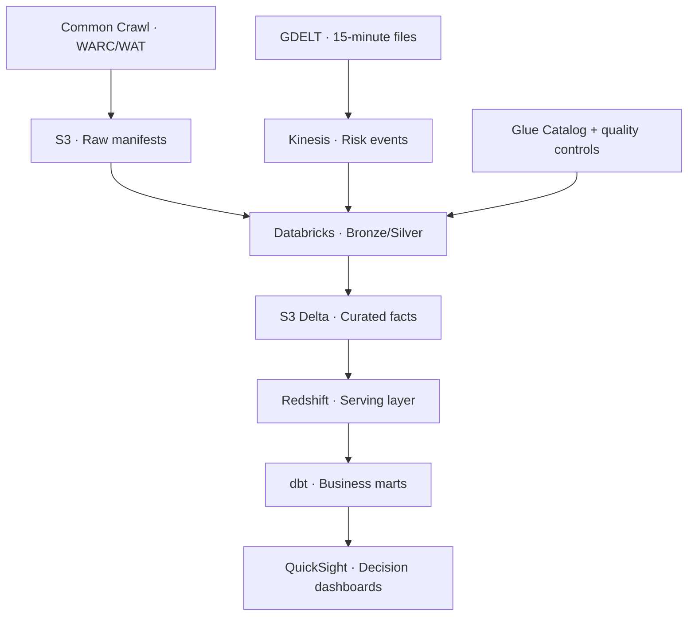
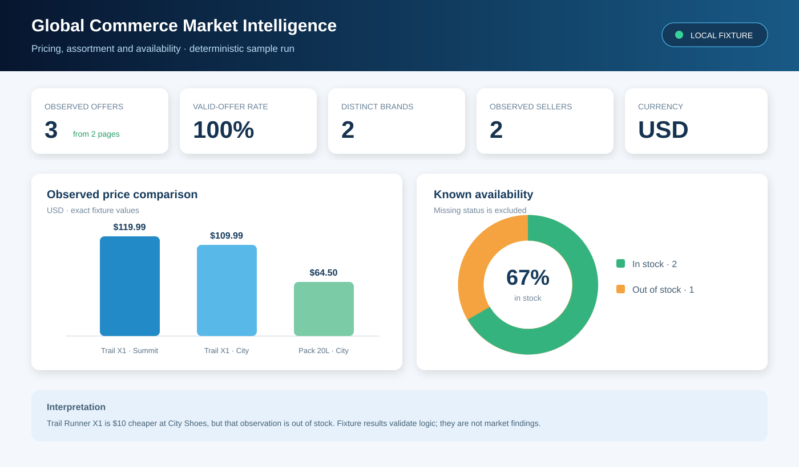

# 🌍 Global Commerce Market Intelligence

> A petabyte-scale AWS lakehouse that turns the open web into pricing, assortment, availability, and market-risk intelligence.


`aws` `s3` `glue` `kinesis` `databricks` `pyspark` `delta-lake` `redshift` `dbt` `quicksight` `terraform` `data-engineering`

## 🎯 What this project solves

Retailers and manufacturers cannot reliably compare their prices, assortment, seller coverage, and product availability across millions of public storefronts. Manual research is slow, narrow, and stale. This platform extracts structured commerce signals from the open web and combines them with live market-risk events so commercial teams can act on measurable evidence.

The dashboard supports five decisions:

1. **Pricing:** Where are products priced above or below the observed market?
2. **Assortment:** Which brands, categories, or products are missing from a market?
3. **Availability:** Where are stock-outs rising?
4. **Seller coverage:** Which merchants and regions offer the strongest coverage?
5. **Risk:** Which news and supply-chain events may explain sudden market changes?

## 📦 Open data sources

| Source | Data used | Delivery | Role |
|---|---|---|---|
| [Common Crawl](https://commoncrawl.org/) | WARC/WAT/WET crawl files and crawl indexes | Monthly crawl releases in public object storage | Petabyte-scale source of public product and offer pages |
| [Schema.org Product](https://schema.org/Product) | Product, brand, SKU, GTIN, rating and offer markup | Extracted from HTML/JSON-LD | Standard commerce contract |
| [GDELT 2.1](https://www.gdeltproject.org/) | Global events and news metadata | New files every 15 minutes | Near-real-time brand, logistics and market-risk enrichment |
| [AWS Open Data Registry](https://registry.opendata.aws/commoncrawl/) | Public Common Crawl access instructions | S3 | Cloud-local access without copying the complete corpus first |

No synthetic records are presented as source observations. A deterministic fixture generator exists only for local development and automated tests.

## 📏 Petabyte-scale contract

“Petabyte scale” refers to source bytes discovered and processed, not inflated copies of sample data.

| Profile | Input scope | Purpose |
|---|---:|---|
| Local | 100–10,000 fixture pages | Fast development and unit tests |
| Integration | Selected crawl segments, GB–TB | AWS connectivity and end-to-end validation |
| Benchmark | 1–10 TB measured run | Throughput, cost and scaling evidence |
| Production | At least 1 PB of crawl input annually | Market-wide intelligence |

Every production run records crawl ID, segment manifests, compressed input bytes, records attempted, valid products, rejected records, duplicates, elapsed time and estimated cost. The project never claims a petabyte run without those manifests.

## 🏗️ Architecture



S3 remains the system of record. Redshift stores conformed facts, dimensions, aggregates and materialized views—not raw WARC payloads. Dashboards query dbt marts rather than scanning raw crawl data.

## 🔄 Methodology

1. **Discover:** Resolve immutable Common Crawl manifests and GDELT batches.
2. **Ingest:** Register source files and preserve provenance in S3.
3. **Extract:** Parse JSON-LD and supported microdata into a versioned product contract.
4. **Standardize:** Normalize URLs, currencies, units, availability and identifiers.
5. **Resolve:** Deduplicate pages and match products using GTIN/SKU first, then controlled rules.
6. **Enrich:** Join geography, merchant, category and relevant GDELT risk signals.
7. **Model:** Build dimensional facts and business marts in dbt.
8. **Serve:** Publish tested aggregates to QuickSight.
9. **Observe:** Record freshness, completeness, validity, uniqueness, throughput and cost.

## 🧱 Data model

| Model | Grain | Business use |
|---|---|---|
| `fct_product_offer_snapshot` | Product × seller × page × observation time | Price and availability history |
| `fct_market_risk_event` | GDELT event × organization × location | Market and supply-chain monitoring |
| `dim_product` | Resolved product | Comparable product identity |
| `dim_merchant` | Canonical merchant/domain | Seller coverage |
| `dim_market` | Country/region/currency | Geographic comparison |
| `mart_price_position` | Product × market × day | Price index and outlier detection |
| `mart_assortment_gap` | Brand × category × market × week | Missing-range opportunities |
| `mart_availability_risk` | Product/category × market × day | Stock-out trends and risk context |

## 📊 Dashboard outcomes

The executive page reports observed products, merchants, markets, valid-offer rate, median price index, availability rate and risk-event count. Drill-down pages cover price position, assortment gaps, seller coverage, availability trends, source quality and pipeline cost.\n\n\n\nThe preview uses the committed deterministic fixture results. It shows why pricing and availability must be read together: the fixture's cheaper Trail Runner X1 offer is also out of stock. See the complete [`dashboard specification`](dashboards/README.md).

Interpretation rules are explicit: observations are public-web signals, not audited sales; currency comparisons require a dated FX rate; missing markup is not treated as zero inventory; price outliers require adequate seller coverage; and crawl coverage changes are shown beside business trends.

## 📁 Repository map

```text
.
├── configs/              # Versioned workload profiles
├── contracts/            # Source and curated data contracts
├── dashboards/           # KPI definitions and dashboard specification
├── dbt/                  # Redshift staging, facts, marts and tests
├── docs/                 # Business case, architecture and source notes
├── infrastructure/       # Terraform modules and environments
├── notebooks/            # Exploration only; production logic stays in src
├── scripts/              # Reproducible validation and scale commands
├── src/                  # Ingestion, parsing and PySpark transformations
└── tests/                # Unit and contract tests
```

## 🚀 Reproduce locally

```bash
python3 -m venv .venv
source .venv/bin/activate
pip install -r requirements-dev.txt
make all
python scripts/estimate_scale.py --profile production
```

Local tests require no AWS credentials and do not download crawl archives. AWS deployment is intentionally opt-in because it creates billable resources.

## 🧪 Verified local results

The committed fixture run processed two pages into three valid product-offer observations. It achieved a 100% minimum-contract validity rate, identified two brands and one currency, and retained seller and availability differences needed by the price and stock-risk marts. These are deterministic engineering-test results—not market findings and not a claimed petabyte execution.

See [`results/sample_run/metrics.json`](results/sample_run/metrics.json), [`product_offers.csv`](results/sample_run/product_offers.csv), and the [`result interpretation`](results/sample_run/interpretation.md). A production claim requires an immutable Common Crawl manifest and measured input bytes.

## ✅ Definition of done

- Source manifests prove the bytes and records processed.
- Every curated field traces back to a source URL, crawl ID and observation time.
- Invalid and ambiguous records are quarantined rather than silently discarded.
- dbt tests enforce keys, relationships, accepted values and freshness.
- Reprocessing the same manifest is idempotent.
- The dashboard exposes coverage and data-quality context with every market KPI.
- Infrastructure, jobs and business models are version controlled and deployable from scripts.

## ⚖️ Responsible use

The platform processes public crawl data in accordance with applicable source terms and organizational policy. It minimizes retained page content, excludes secrets and personal data from curated models, supports domain-level suppression, and publishes aggregated business intelligence rather than republishing source pages.

## 🗺️ Delivery status

The repository currently provides the project contract, source strategy, scale calculator, parser baseline, data contracts, dashboard specification and offline validation tests. Cloud deployment modules and production Databricks/dbt jobs are tracked as implementation milestones; they are not described as already deployed.

## 📄 License

Code in this repository is released under the MIT License. Source datasets retain their original terms and licenses.
